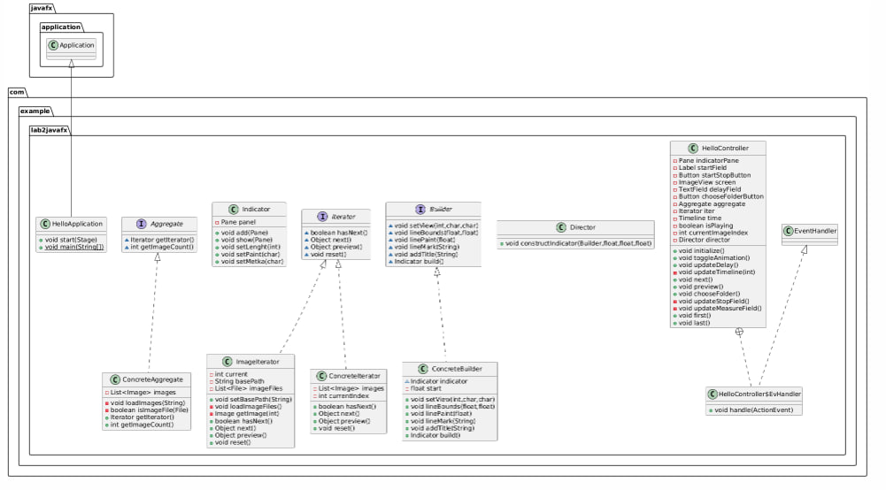

# Лабораторная работа: Просмотр изображений с индикатором (4-5)

## Описание проекта
Этот проект представляет собой приложение для просмотра изображений, разработанное с использованием JavaFX.
Приложение позволяет пользователю просматривать изображения из выбранной папки, переключаться между ними,
а также отображает индикатор, показывающий текущее положение изображения в последовательности.

## Функциональность
* Просмотр изображений: Пользователь может выбирать папку с изображениями и просматривать их в последовательности.
* Навигация по изображениям: Пользователь может переходить к следующему или предыдущему изображению, а также переходить к первому или последнему изображению в папке.
* Автоматическое воспроизведение: Пользователь может запустить автоматическое воспроизведение изображений с заданной задержкой.
* Индикатор: Приложение отображает индикатор, который показывает текущее положение изображения в последовательности.
* Выбор папки: Пользователь может выбрать папку с изображениями через диалоговое окно.

## Требования
* Java 11 или выше
* JavaFX SDK

## Основные компоненты
* `HelloApplication`: Отвечает за запуск приложения и загрузку интерфейса.
* `HelloController`: Управляет логикой приложения, обрабатывает пользовательский ввод и взаимодействует с итератором изображений.
* `ImageIterator`: Реализует интерфейс Iterator для последовательного перебора изображений в папке.
* `ConcreteAggregate`: Реализует интерфейс Aggregate и предоставляет доступ к коллекции изображений.
* `Indicator`: Отображает индикатор, показывающий текущее положение изображения в последовательности.
* `Director` и `Builder`: Используются для построения индикатора с заданными параметрами.

## Структура проекта
```
src
└── main
    ├── java
    │   └── com.example.lab2javafx
    │       ├── HelloApplication.java         # Основной класс приложения
    │       ├── HelloController.java          # Контроллер
    │       ├── ImageIterator.java            # Итератор для перебора изображений
    │       ├── ConcreteAggregate.java        # Реализация агрегата для коллекции изображений
    │       ├── ConcreteIterator.java         # Реализация итератора для работы с коллекцией изображений
    │       ├── Indicator.java                # Класс для отображения индикатора
    │       ├── Director.java                 # Класс, управляющий построением индикатора
    │       ├── ConcreteBuilder.java          # Реализация строителя для индикатора
    │       ├── Iterator.java                 # Интерфейс итератора
    │       ├── Aggregate.java                # Интерфейс агрегата
    │       └── Builder.java                  # Интерфейс строителя
    └── resources
        └── com.example.lab2javafx
            └── hello-view.fxml               # Файл FXML, описывающий пользовательский интерфейс
```

## Архитектура
